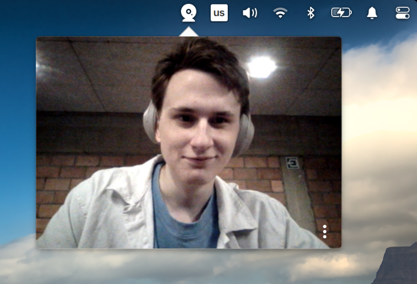

# Shelf Mirror

A native [Wingpanel](https://github.com/elementary/wingpanel) indicator for
elementary OS that drops a live camera view into the top panel — a quick mirror
for checking your hair before a call. Click the icon to open it, click anywhere
else to close it (the panel dismisses the popover and the camera is released).

Written in Vala, GTK 3, GStreamer, and Cairo.

<p align="center">
  
</p>

## Features

- **Live mirror** — the feed is flipped horizontally so it reads like a real
  mirror, and the view fills the popover edge to edge with rounded corners that
  match the elementary popover.
- **Polished loading state** — while the camera spins up the view is blurred
  and dimmed under elementary's themed spinner, then reveals the crisp feed.
- **Menu** — a subtle OSD button (bottom-right) opens a context menu with
  **Settings** and **About**.
- **Webcam picker** — Settings lets you choose which camera to use; the choice
  persists via GSettings.
- **Graceful failure** — if the camera can't start, it shows "Camera
  unavailable" instead of a blank view.

## How it works

It's a Wingpanel **plugin** (a shared module loaded into the panel process), not
a standalone app. The panel looks up the exported `get_indicator ()` entry point
and calls into a `Wingpanel.Indicator` subclass:

- `get_display_widget ()` returns the panel icon.
- `get_widget ()` returns the popover content — a `Gtk.Stack` with three views:
  the camera, Settings, and About.
- `opened ()` / `closed ()` start and stop streaming, so the camera is only held
  while the popover is visible. "Closes when you click elsewhere" is Wingpanel's
  built-in popover behaviour — no extra focus handling needed.

The camera view pulls frames from an `appsink`
(`v4l2src ! videoflip ! videoconvert ! videoscale ! BGRA ! appsink`) and paints
them by hand into a windowless `Gtk.DrawingArea`. Drawing the frames ourselves —
rather than using `gtksink`, whose widget owns its own rectangular window — is
what lets us clip the feed to rounded corners and render the blurred, translucent
loading state. The spinner and menu button float on top via a `Gtk.Overlay`.

To survive the camera occasionally wedging on a fast reopen, the pipeline is
rebuilt fresh on every open and supervised by a watchdog that retries if no
frame arrives.

## Dependencies

```
sudo apt install valac meson \
    libwingpanel-dev libgtk-3-dev libcairo2-dev \
    libgstreamer1.0-dev libgstreamer-plugins-base1.0-dev \
    gstreamer1.0-plugins-good gstreamer1.0-plugins-base
```

`libgstreamer-plugins-base1.0-dev` provides the `gstreamer-app-1.0` bindings;
`gstreamer1.0-plugins-good` provides `v4l2src` and `videoflip` at runtime.

## Build & install

```
meson setup build --prefix=/usr
ninja -C build
sudo meson install -C build
```

`--prefix=/usr` is so the GSettings schema lands in `/usr/share/glib-2.0/schemas`
(where the panel finds it); the module itself always installs into Wingpanel's
indicator directory (`pkg-config --variable=indicatorsdir wingpanel`),
independent of the prefix. The install step also compiles the schema.

Restart the panel to load it — just kill it and let gala respawn it:

```
killall io.elementary.wingpanel
```

## Known issue: Apple FaceTime HD camera

The `facetimehd` driver (FaceTime HD cameras on Intel Macs) does DMA without
setting up IOMMU mappings, so with Intel VT-d enabled the kernel faults the
camera's DMA (`DMAR: PTE Write access is not set`), the ISP times out, and the
view stays "Camera unavailable" intermittently. The fix is a kernel boot
parameter — add `intel_iommu=off` (or the lighter `iommu=pt`) to
`GRUB_CMDLINE_LINUX_DEFAULT` in `/etc/default/grub`, then:

```
sudo update-grub && reboot
```

This is a hardware/driver quirk, not a Shelf Mirror bug — other cameras are
unaffected.
